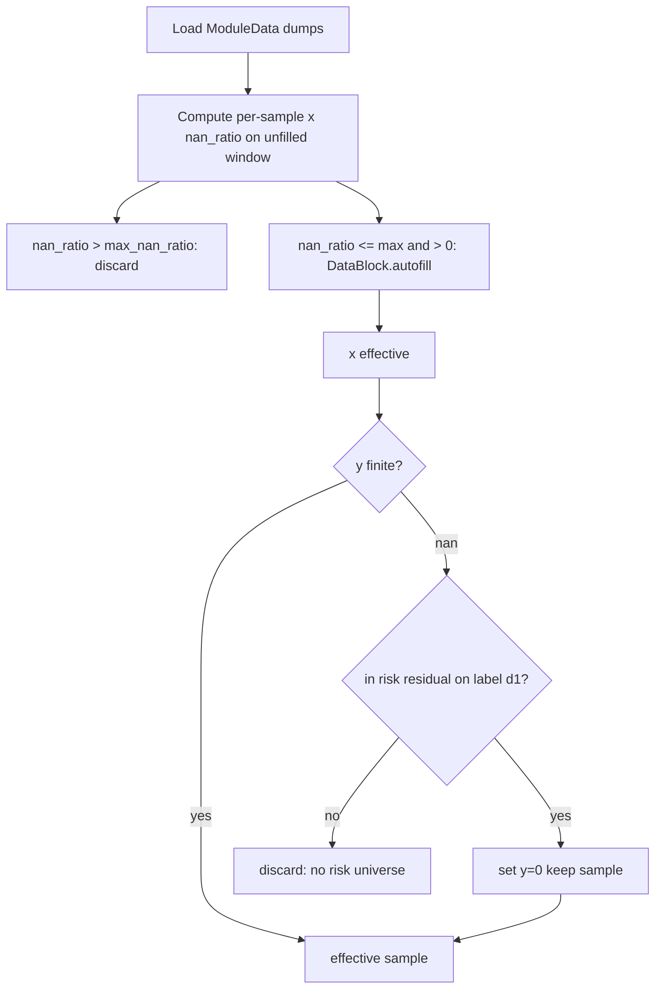

# 样本有效性与 Coverage 改造（默认保持旧行为）

## 约束与默认行为

- **不重算**既有 `DataBlock` preprocess dump / `labels_ts` 历史文件。
- `input.verify.x.max_nan_ratio` **默认 `0`** → 与当前 NN `require_all` 等价（长停牌整窗全缺仍丢弃）。
- 旧逻辑作为默认；仅当 config 显式调高 `max_nan_ratio` 或走新的 y 填 0 规则时行为变化。

## 配置（默认写在 optional）

在 [`configs/model/default/optional.yaml`](configs/model/default/optional.yaml) 增加：

```yaml
input.verify.x.max_nan_ratio: 0.0
input.verify.x.autofill:
  vol_feat: 0
  vol_price: forward
  vol_other: forward
```

- `max_nan_ratio`：回看窗内 **所有通道合并** 的 NaN 占比上限（`nan_count / numel` over `(seq, inday, feat)`）。
- `autofill.*`：原样传给 [`DataBlock.autofill`](src/data/util/classes/data_block.py)（已有 `vol_feat` / `vol_price` / `vol_other`）。
- schedule 里可按模型覆盖，例如 `max_nan_ratio: 0.1`。

在 [`ModelConfig`](src/res/model/util/config/config.py) 增加只读属性读取上述键（与现有 `input.data.prenorm` 风格一致）。

## 数据流（训练时）



## 1) x：短停牌容忍 + autofill

改 [`DataOperator`](src/res/model/util/data/operations.py) / [`DataModule.setup_loader_static`](src/res/model/util/data/data_module.py)：

1. **先在未填充数据上**算每个 `(secid, sample_date)` 的 `nan_ratio`（各 input key 对 NN 取 max/all，与现 `finite_position` 的 all 语义一致）。
2. `nan_ratio > max_nan_ratio` → 无效（覆盖长停牌与过多空洞）。
3. 若 `max_nan_ratio > 0`：对 `self.datas.x` 中 `input_data_types` 对应 `DataBlock` 调用 `autofill(**config)`（沿 date 轴；对缓存做一次即可，forward-fill 与 model_date 无关）。`max_nan_ratio==0` 时不调用，避免无意义改写。
4. 将原 NN `finite_position(require_all)` 改为：`nan_ratio <= max_nan_ratio`；`DivLast` 的 endpoint nonzero 仍在 **fill 后**检查。

默认 `0`：不 fill、仍要求全有限 → 与现网一致。

## 2) Effective Count 分母对齐风险模型 IPO

CNE5 estuniv 使用 [`list_days = 252`](src/res/factor/risk/cne5.py)（`get_list_dt(date, 252)` = list_dt **+252 交易日**）。

当前 Coverage 用 [`list_num_by_date(..., offset=30)`](src/data/util/stock_info.py)。

改动：

- 抽出共享常量（例如 `RISK_LIST_DAYS = 252`，cne5 与 `list_num_by_date` 共用，避免两处漂移）。
- `list_num_by_date` 默认 `offset` 改为 `252`（或显式参数默认 252）。
- [`display_loader_static_stats`](src/res/model/util/data/data_module.py) 继续调用同一 API，分母自动对齐。

说明：只对齐 **IPO 天数**，不引入 ST/市值等完整 estuniv 过滤（按你的第 3 点范围）。

## 3) y：远期无交易视为收益 0（不重算历史 dump）

**问题**：现有 dump 里「无 risk residual」与「远期 d1 无交易」都是 `y=NaN`，不能一律填 0（否则会把你要丢掉的无风险宇宙股票加回来）。

**训练时（吃现有 dump）**：

- x 已有效且 `y` 有限 → 保持有效。
- x 已有效且 `y` 为 NaN：
  - 若该票在 label 终点日 `d1` 的 **risk residual / exret 宇宙内** → `y=0` 并保留样本（对应「远期无交易≈收益 0」）。
  - 否则 → 仍丢弃（对应「无 risk residual、不预测」）。
- `d1` 由 label 名解析（如 `std_lag1_10` / `rtn_lag1_10` → lag=1, days=10），与 [`calc_classic_labels`](src/data/update/custom/labels.py) 一致。
- 填 0 发生在 `effective_samples` / `standardize_y` 之前对 `y_std` 的局部 clone，避免污染整份 `self.labels` 缓存语义不清；fit 阶段写入采样后的 `y_sampled` 即可。

**增量 labels 更新器（不强制重跑历史）**：

- 改 [`get_period_ret`](src/data/update/custom/labels.py)：以 `d0` 行情为左表 left-join `d1`；`p1` 缺失时 **ret=0**（价格视为不变）。
- 保持与 residual 的 **inner merge**（无风险宇宙仍不进 `labels_ts`）。
- 仅影响之后新算/补算的日期；旧文件靠训练时路径覆盖。

## 4) 诊断脚本（可选小改）

更新 [`scripts/0_check/7_diagnose_uncovered_cases.py`](scripts/0_check/7_diagnose_uncovered_cases.py) 的分母 offset 与「y 填 0 后门控」说明，便于回归对比；非必须阻塞主改动。

## 主要改动文件

| 文件 | 改动 |
|------|------|
| `configs/model/default/optional.yaml` | 新增 `input.verify.x.*` 默认 |
| `src/res/model/util/config/config.py` | 读取 verify/autofill |
| `src/res/model/util/data/operations.py` | nan_ratio、fill 后 finite、y=0+risk 门控 |
| `src/res/model/util/data/data_module.py` | setup 时 autofill；Coverage 用新分母 |
| `src/data/util/stock_info.py` | `list_num_by_date` offset→252 |
| `src/res/factor/risk/cne5.py` | 使用共享 `RISK_LIST_DAYS` |
| `src/data/update/custom/labels.py` | `get_period_ret` 缺失终点→0 |

## 风险

- `max_nan_ratio>0` 时 forward-fill 会把停牌日变成“静止价量”，需靠 ratio 阈值控制；默认 0 无回归。
- 训练时对 `std_*` 填 0 是对「rtn=0 再中性化」的近似（因不重算 preprocess）；`rtn_*` 更贴近字面含义。
- Coverage 分母改 252 后数值会系统性上升，属预期口径变化。
