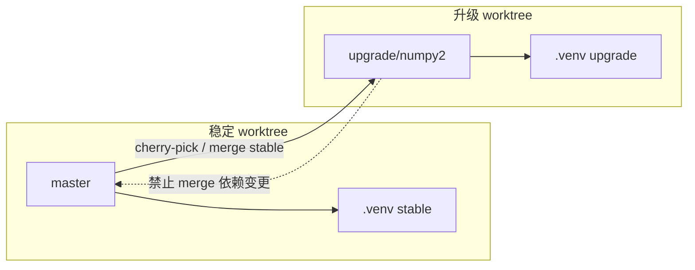
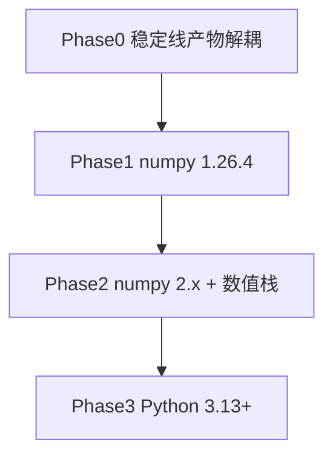

# learndl 双分支依赖升级工作流

## 目标与原则

- **稳定线**（`master` 或 `stable/py312`）：保持 [pyproject.toml](pyproject.toml) 现有 pin（`numpy==1.26.0`、`torch==2.7.1` 等），只修生产/日常运行 bug。
- **升级线**（`upgrade/numpy2`）：分阶段提升 NumPy（为后续 Python 3.13+ 铺路），解决 ABI/数值/导入问题。
- **吸收方向**：稳定 → 升级（单向）；升级线未验证前，**禁止**把依赖变更 merge 回稳定线。
- **环境隔离**：每个 worktree 独立 `.venv`；数据目录仍共用 [PATH](src/proj/env/path.py)（同机 `MACHINE.main_path`），升级实验**只读 canonical 数据、写入 interim/results 子目录**。



---

## 一、仓库与 worktree 布局（macOS）

### 1. 处理当前基线

`master` 已有提交 `minor upgrade, prepare to upgrade numpy`，可作为双轨起点。

### 2. 创建分支与 worktree

```bash
# 稳定线：继续用现有目录
# /Users/mengkjin/workspace/learndl  →  master

# 升级线：从 master 拉出
git branch upgrade/numpy2 master
git worktree add ../learndl-upgrade upgrade/numpy2
```

### 3. 各 worktree 环境约定

| 目录 | 分支 | Python | venv |
|------|------|--------|------|
| `learndl/` | `master` | 3.12.x | `.venv`（numpy 1.26.0 栈） |
| `learndl-upgrade/` | `upgrade/numpy2` | 3.12.x（先不变） | `.venv`（升级实验栈） |

```bash
# 分别在两个目录执行一次
uv venv --python 3.12
uv sync
```

### 4. 日常规则

- 改 bug → 只在 `learndl/`（master）提交。
- 改依赖 / 验证 NumPy 2 → 只在 `learndl-upgrade/` 提交。
- 不在两个目录间手动复制 `.venv` 或 `pyproject.toml`。
- Cursor/IDE：两个窗口分别打开两个 worktree 根目录。

---

## 二、稳定线 → 升级线：合并策略

### 推荐默认：cherry-pick（代码修复）

适用于单文件/小范围 bugfix（`src/`、`scripts/`、`configs/` 中与 pin 无关的改动）。

```bash
cd ../learndl-upgrade
git cherry-pick <stable-commit-sha>
# 若有冲突：保留升级线的 pyproject.toml / lock；代码逻辑取稳定修复
```

**优先 cherry-pick 的改动类型**

- 业务逻辑、数据处理、训练流程 bug
- Streamlit / 脚本修复
- 配置 YAML（非环境相关）

**不要 cherry-pick / 需人工处理的改动**

- `pyproject.toml` 依赖版本变更
- 仅为稳定环境写的 workaround（若与 NumPy 2 API 冲突）

### 定期同步：merge stable into upgrade（每周或每 N 个稳定提交）

当稳定线积累较多修复、cherry-pick 繁琐时：

```bash
cd ../learndl-upgrade
git merge master
# 冲突解决原则：
#   - pyproject.toml / uv.lock → 一律保留 upgrade 分支版本
#   - src/, configs/, scripts/ → 合并双方逻辑，以稳定修复为准
```

### 禁止方向

- **不要** `git merge upgrade/numpy2` 到 `master`，直到升级线完成全链路验证并明确决策上线。

### 提交规范（便于 cherry-pick）

稳定线 commit message 区分类型，例如：

- `fix(factor): ...` — 可直接 cherry-pick
- `chore(deps): ...` — 仅稳定线，不 pick 到升级线

---

## 三、升级分阶段路线图

NumPy 2 与 Python 3.13 不能跳步；建议三阶段：



| 阶段 | 分支 | pyproject 变化 | 目的 |
|------|------|----------------|------|
| Phase 0 | 稳定 + 升级（代码可先在稳定合并） | 不变 | manifest、推理路径低耦合 |
| Phase 1 | 仅升级线 | `numpy==1.26.4` | 同 ABI 补丁验证流程 |
| Phase 2 | 仅升级线 | `numpy>=2.2,<2.5` + 必要时放宽 scipy/pandas pin | 主升级目标 |
| Phase 3 | 仅升级线 | `requires-python>=3.13` + 全量重装 | NumPy 2 验证通过后再做 |

---

## 四、完整依赖升级检查清单（按验证顺序）

在 `learndl-upgrade` 每进入下一阶段，按下列顺序 **import 冒烟 → 最小业务脚本 → 全链路**。失败则停在该包，查 wheel / 升版本 / 联系 vendor。

### Tier 0 — 基础（Phase 1: 1.26.4 / Phase 2: 2.x 必测）

| # | 包 | 当前 pin | Phase 1 | Phase 2 动作 | 验证命令要点 |
|---|-----|----------|---------|--------------|--------------|
| 1 | numpy | `==1.26.0` | → `1.26.4` | → `2.2.x` 或 `2.3.x` | `import numpy; numpy.__version__` |
| 2 | scipy | `==1.15.3` | 不动 | 保持或随生态升 patch | `import scipy.linalg` |
| 3 | pandas | `==2.3.0` | 不动 | 保持 2.3.0（已支持 NumPy 2） | 读一条 `DB.load` feather |
| 4 | scikit-learn | `==1.7.0` | 不动 | 保持 | `import sklearn` |
| 5 | matplotlib | `==3.10.3` | 不动 | 保持 | `import matplotlib` |

### Tier 1 — 深度学习 / Boost（Phase 2 重点，ABI 敏感）

| # | 包 | 验证 |
|---|-----|------|
| 6 | torch `==2.7.1` | `import torch`; MPS 可用性；`tensor.numpy()` 往返 |
| 7 | lightgbm `>=4.6.0` | 训练 stub + `predict` |
| 8 | xgboost `>=3.0.4` | 同上 |
| 9 | catboost `>=1.2.8` | 同上 |
| 10 | shap `>=0.48.0` | [lgbm.py](src/res/algo/boost/booster/lgbm.py) 解释路径可选测 |

### Tier 2 — 组合优化（macOS 高风险）

| # | 包 | 代码入口 | 验证 |
|---|-----|----------|------|
| 11 | mosek `>=11.0.28` | [mosek.py](src/res/factor/fmp/optimizer/solver/mosek.py) | 小规模 SOCP 求解 |
| 12 | cvxpy `>=1.7.2` | [cvxpy.py](src/res/factor/fmp/optimizer/solver/cvxpy.py) | ECOS/SCS/MOSEK 后端 |
| 13 | cvxopt `>=1.3.2` | 无直接 import，可能冗余 | import；若无引用可考虑从升级线移除 |

### Tier 3 — 数据源 / 闭源（可能阻塞 Phase 2）

| # | 包 | 代码入口 | 备注 |
|---|-----|----------|------|
| 14 | rqdatac `>=3.2.11` | [rcquant/](src/data/download/other_source/rcquant/) | 闭源 wheel，无支持则 Phase 2 暂挂 |
| 15 | pyreadr `>=0.5.3` | [jsfetcher.py](src/data/update/hfm/jsfetcher.py) | HFM 路径实测 `read_r` |
| 16 | fastparquet `>=2025.12.0` | [dataframe.py](src/proj/db/io/dataframe.py) | parquet 读写 roundtrip |
| 17 | tushare / baostock | 数据下载 | 轻量 import |

### Tier 4 — 应用与其它

| # | 包 | 验证 |
|---|-----|------|
| 18 | streamlit `==1.56.0` | `uv run launch.py` 启动 |
| 19 | polars `>=1.32.3` | 因子 polars 路径 |
| 20 | dask / xarray / statsmodels / optuna | import + 用到再深测 |
| 21 | tensorboard | import |
| 22 | tsfresh `>=0.21.1` | 仅 todo 脚本，优先级最低 |

### 每阶段必跑业务冒烟（升级线）

1. **数据 IO**：`df_io` feather/parquet 读一条 `DataBase` 序列
2. **因子**：单因子单日 `FactorAPI` 或 calculator smoke
3. **训练**：短 schedule `ModelAPI.schedule_model`（nn 或 boost 二选一）
4. **推理**：`ArchivedPredictorModel` / `ModelFile` 加载 `state_dict.pt`
5. **FMP**：mosek + cvxpy 各跑一次小规模优化
6. **静态检查**：`ruff check src scripts`；`pyright src`

### Phase 2 数值回归（与 Phase 0 产物策略联动）

- 固定 seed，对比 3–5 个交易日的因子截面相关 / Rank IC
- 对比 FMP 权重 L2 差异
- 差异超过阈值则记录到 `docs/agent/local/sessions/`（本地，不入 Git）

---

## 五、产物低耦合改造（主要在稳定线推进，升级线受益）

物理目录已隔离（[path.py](src/proj/env/path.py)）；需降低**序列化与运行时**耦合。建议按优先级在 **master** 实现，再 cherry-pick 到 `upgrade/numpy2`。

### 产物分级

| 级别 | 路径 | 格式 | 升级策略 |
|------|------|------|----------|
| Canonical | `data/DataBase/`, `data/Export/` | feather/parquet | 已低耦合，保持 |
| Long-lived | `models/` | `state_dict.pt` 等 | 加 manifest；推理 `weights_only` |
| Ephemeral | `data/Interim/`（Checkpoint, DataCache, DataBlock） | `.pt`/`.mmap` | 升级前整目录清理 |
| Disposable | GP `.pkl` | joblib | 升级可弃；或导出 parquet 摘要 |
| Results | `results/` | 各类 | 可重建 |

### 改造项（按实施顺序）

**1. 模型 manifest（高优先级）**

- 在 [model_file.py](src/res/model/util/core/model_file.py) `ModelDict.save()` 同目录写 `manifest.json`：
  - `learndl_version`, `python`, `numpy`, `torch`, `saved_at`, `artifact_type: state_dict_only`
- [ModelFile.load](src/res/model/util/core/model_file.py) 可选读 manifest 打 warning（版本不匹配时）

**2. 推理加载默认安全模式**

- [torch.py](src/proj/db/io/torch.py) / [loader.py](src/proj/db/io/loader.py)：生产推理路径默认 `weights_only=True`（训练 checkpoint 仍 `False`）
- 与 [predictor_model.py](src/res/model/util/trainer/predictor_model.py) 加载路径对齐

**3. Interim 缓存策略文档化 + 清理脚本**

- 在升级线验证前执行：清空 `PATH.checkpoint`, `PATH.datacache`, `PATH.block`（可写 `scripts/0_check/` 下只读确认 + 清理脚本）
- [data_block.py](src/data/util/classes/data_block.py)：新缓存优先 `PREFERRED_DUMP_SUFFIX = '.mmap'`（已存在常量）

**4. GP joblib（低优先级）**

- [recorder.py](src/res/gp/util/recorder.py) 的 historybook：标记为 disposable；新 run 可选导出关键指标到 parquet

**5. tar 导出 meta 扩展**

- [tarfile.py](src/proj/db/io/tarfile.py) 已有 `meta.json`：扩展 `numpy`/`python` 字段，便于日后审计

### 双分支下产物操作纪律

- 升级线跑训练/回测：输出写到 `results/upgrade_test/` 或 `data/Interim/`（不写 `Export` canonical）
- 数值对比：只读 `data/Export/` 历史因子，新结果写隔离目录

---

## 六、升级线 pyproject 变更模板（Phase 2 示例）

仅在 `learndl-upgrade` 修改：

```toml
# Phase 1
numpy = "==1.26.4"

# Phase 2（示例，以 uv resolve 为准）
numpy = ">=2.2.0,<2.5"
# pandas/scipy/sklearn/torch 先保持现有 pin，resolve 失败再逐个放宽 patch
```

每次变更后：`uv sync` 全量重装（不要只 `uv add numpy`），再跑 Tier 0→4 清单。

---

## 七、完成标准与合并回 master 的条件

升级线合并回 `master` 需全部满足：

1. Tier 0–4 import + 业务冒烟通过（macOS）
2. 数值回归差异在可接受阈值内（或已文档化已知差异）
3. `mosek` / `rqdatac` / `pyreadr` 无阻塞（或已确认生产不用并移除依赖）
4. 稳定线未合并的 fix 已全部 absorb 到升级线
5. `ruff` + `pyright` 通过

合并方式：将 `upgrade/numpy2` merge 到 `master`（一次性），删除 worktree，主目录 `uv sync` 重建 venv。

---

## 八、建议时间线（可并行）

| 并行轨 A（master） | 并行轨 B（upgrade/numpy2） |
|-------------------|---------------------------|
| 日常 bugfix | 建 worktree + Phase 1（1.26.4） |
| manifest + 推理 weights_only | Phase 2 Tier 0–1 冒烟 |
| Interim 清理约定 | Tier 2–3（mosek/rqdatac） |
| cherry-pick 到升级线 | 数值回归 → Phase 3 预备 |

Phase 3（Python 3.13）仅在 Phase 2 全绿后，在升级线将 `requires-python` 提升至 `>=3.13` 并重复 Tier 清单。
