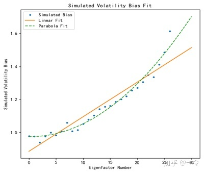

[TOC]
## 1.天风Barra因子介绍
### 1.1.Beta
**beta**
$$beta=490个交易日内的股票收益与市场收益wls回归后的系数$$其中，市场收益为当前市场股票基于根号下自由流通市值加权后的收益，回归权重为半衰期加权，半衰期为245天。此处Beta计算时使用了如下公式：

设权重为w，x与y的关系为
$$y=\beta_0 + \beta_1 x$$求解得
$$\hat{\beta_1} = \frac{\sum_i{w_i x_i y_i} - (\sum_i{w_i x_i})(\sum_i{w_i y_i})}{\sum_i{w_ix_i^2} - (\sum_i{w_i x_i})^2}$$
### 1.2.Bp
**btop**
股票当前净资产与总市值之比
### 1.3.Diviyld
**dtop** 
$$dtop=\frac{现金分红}{最近一个月总市值均值}$$
其中，
1）现金分红在年报分红预案发布后计算，为一年内的总分红，后续会根据分红实施情况进行调整。
2）对于净资产超过一定标准（如五千万）的股票，会乘以调整系数，
$调整系数=最近季度净资产/分红对应的年报净资产$
### 1.4.Earnvar
**earning_var**
$$earning_var=\frac{最近三年净利润标准差}{最近三年净利润绝对值均值}$$
**sales_var**
$$sales\_var=\frac{最近三年营业收入标准差}{最近三年营业收入均值}$$
**cash_flows_var**
$$cash\_flows\_var=\frac{最近三年经营现金流标准差}{最近三年经营现金流绝对值均值}$$
### 1.5.Earnyild
**etop**
$$etop=\frac{最近年度净利润}{最近一个月总市值均值}$$
**cetop**
$$cetop=\frac{最近年度经营现金流}{最近一个月总市值均值}$$
### 1.6.Growth
**egro**
$$egro=\frac{最近三年净利润与(1,2,3)回归后的系数}{最近三年净利润绝对值均值}$$
**sgro**
$$sgro=\frac{最近三年营业收入与(1,2,3)回归后的系数}{最近三年营业收入均值}$$
### 1.7.Insqlty
**agro**
$$agro = -\frac{最近三年总资产与(1,2,3)回归后的系数}{最近三年总资产均值}$$
### 1.8.Leverage
**book_leverage**
$$book\_leverage=\frac{长期负债}{净资产}$$其中，财务数据为最近一年年报数据，银行业与保险业的股票没有该指标
**debt_to_equity**
$$debt\_to\_equity=\frac{总负债}{总资}$$其中，财务数据为最近一年年报数据
### 1.9.Liquidity
**month_turnover**
股票近20个交易日换手率均值 * 20
**quarter_turnover**
股票近60个交易日换手率均值 * 20
**year_turnover**
股票近245个交易日换手率均值 * 20
### 1.10.Momentum
**rstr**
rs为245个交易日内股票收益率加权之和，加权的半衰期为122天
rstr为rs的滚动11日均值再滞后11日
### 1.11.Profit
**asset_turnover**
$$asset\_turnover=\frac{营业收入}{总资产}$$其中，财务数据为最近一年年报数据
**roa**
$$roa=\frac{净利润}{总资产}$$其中，财务数据为最近一年年报数据
**gross_profit**
$$gross\_profit=\frac{营业收入 - 营业成本}{总资产}$$其中，财务数据为最近一年年报数据
**gross_profit_margin**
$$gross\_profit\_margin=\frac{营业收入 - 营业成本}{营业收入}$$，财务数据为最近一年年报数据
### 1.12.Resvol
**dastd**
最近245个交易日股票收益的标准差
**cmra**
股票最近245个交易日累计超额对数收益的最大值与最小值之差。其中，市场收益为全市场股票根号自由流通市值加权后的收益
### 1.13.Size
**size**
最近20日总市值均值的对数
### 1.14.Industry
中信一级行业

## 2.风险模型之共同风险
### 摘要

风险带来盈利的机会，我们控制风险的目的不是最小化风险，而是在精确衡量风险的前提下，合理权衡收益和风险间的关系，选择性暴露风险以获取目标收益。

风险矩阵由共同风险矩阵和异质风险矩阵构成，对共同风险矩阵的调整步骤包括半衰期指数加权、newey-west调整、eigenfactor风险调整，以及regime风险调整。这些风险调整意在消除时间序列自相关性以及预计偏差问题，且调整效果较佳。

### 2.1.背景

本系列通过介绍Barra模型，测试Barra因子表现，窥探市场风格，通过构建多因子风险-收益模型形成一套有效的主动投资管理体系。

Barra模型作为一个风险管理体系，风险模块显得尤为重要。多因子模型的风险计算为通过计算K个因子的收益率协方差矩阵从而衡量N个股票的收益率协方差矩阵，这样可以大幅减小估计变量的数目（$K \ll N$）。而该模块的重点在于如何调整风险矩阵，以使得风险估计更加精准。

本篇是Barra系列的第三篇，本篇着重介绍风险模块中的共同风险矩阵及其调整，在后续的研究系列中会介绍异质风险矩阵的调整。

### 2.2.风险简述

风险是指未来的不确定性，在投资理论中，通常用收益率的标准差来定义股票风险。人们对风险的认知经常带有一定偏见，认为风险是需要尽量规避或消除的事物。众所周知，有一种消除风险的方法叫做不要把鸡蛋放在一个篮子里，指的就是投资多个标的以消除非系统性风险。巴菲特也曾经引用过这句名言，但是他的看法是，“把鸡蛋放在一个篮子里，然后看好这个篮子”。无论是通过分散化投资从而只承担系统性风险，还是在有限的时间和资源下集中投资能力范围内的行业和公司，只一味的回避风险并不是明智的做法。

在Barra体系中，风险是带来盈利的机会，我们控制风险的目的不是最小化风险，而是在精确衡量风险的前提下，合理权衡收益和风险间的关系，有时为了收益可以暴露更多风险。

### 2.3.风险来源拆解

回顾前两篇对多因子模型的介绍，多因子模型的基本想法是通过研究一系列带动个股收益变动的相同变量，即共同因子，预测个股未来收益。类似地，结构化风险模型将个股风险来源切割为共同风险来源和个股异质风险来源。共同风险来源是指股票暴露在共同因子上而导致的风险，异质风险则是指每个公司所特有的，与其他公司无关的风险。相应地，表征风险的个股协方差矩阵被切割为共同收益的协方差矩阵、个股异质收益的协方差矩阵，以及个股对共同风险来源的敏感程度。

这样分解的好处一个是，如果定义相似的股票为对共同因子具有相似敏感性的股票，这样的计算方法下会导致相似股票间有着较高的的相关性，不相似的股票间有较小的相关性。另外，由于因子数目K通常远小于个股数量N，估计K个因子间的收益率协方差矩阵所要求的数据量和计算量都远远小于直接计算N个股票间的收益率协方差矩阵。当直接估计N个个股之间的协方差矩阵时，我们需要估计$\frac{N^2}{2}+\frac{N}{2}$个变量，而估计K个因子间的协方差矩阵时只需要估计$\frac{K^2}{2}+\frac{K}{2}$个变量。
$$Risk=XFX^T+\Delta$$
其中X为个股在全部因子上的暴露度矩阵，F为因子收益率协方差矩阵，$\Delta$为个股异质风险矩阵。由于假设个股间的异质风险相关性为零，异质风险矩阵是一个对角矩阵，对角线上的值为个股残差收益率方差。

接下来，文章主要介绍共同风险矩阵的计算和调整，并以2011年至2018年的沪深300成分股为研究样本。

### 2.4.共同风险模型构建
如下式所示，F表示因子收益率的协方差矩阵，由因子两两间求收益率协方差而得，共同风险为因子暴露度与F相乘。因子暴露度是已知的，代表着个股对某个共同因子收益的敏感程度，F是预测的因子协方差矩阵，也是后面我们的调整目标。
$$Common \, Risk =XFX^T\\
F_{i,j}=Cov(F_i, F_j)
$$
简单地通过计算因子收益率序列的协方差矩阵获得共同风险，意味着我们假设市场表现是一个平稳的过程，每个时间截面的相关信息是相似的，组合对因子的暴露也是稳定的。然而事实显然不是这样，因子收益率相关性随时间发生明显变化，市场组合的波动性也在时间序列上呈现较大变化，代表市场并不是一个平稳过程，直接用上式计算组合风险并不是合适的，有必要对风险矩阵进行调整以更好的适应市场特征。

对于因子收益率协方差矩阵的调整，首先可以对选择使用的时间序列数据赋予不同权重，给予近期数据更大权重，给予远期数据更小权重，这种方法为指数加权法。

#### 2.4.1.半衰期指数加权法

指数加权法是一种非常常用的加权方法，通常应用在时间序列的数值平均中。它赋予更近期的数据更大的权重，赋予较远期的数据更小的权重，这样平均后的数值中包含了更多近期的信息。之所以叫做半衰期指数加权，是参考化学领域中元素半衰期的概念，过去half-life时间的信息量衰减到当前期信息量的一半，相应地，过去half-life时间的权重为当前期权重的一半。
$$\delta=0.5^{\frac{1}{half-life}}$$$$
w_t=\delta^{T-t}$$

#### 2.4.2.Newey-West调整

除了运用指数加权的方法处理因子收益率时间序列之外，Barra模型中还使用了newey-west的调整方法以解决序列自相关的问题。Barra文档中并未详细说明newey-west调整的具体操作步骤，但是这种方法在若干个版本的Barra模型中均有应用，并且这是一个在计量领域经常用到的方法，足以见其重要性。我们参考Newey and West在1987年发表的文章《A simple, positive semi-definite, heteroskedasticity and autocorrelation consistent covariance matrix》，以及其他关于这方面的研究文章，在此希望能将该调整阐述清楚。

1、相合估计

Newey and West所研究的相合估计，是为了解决序列具有自相关性的一种估计量。统计意义上可以理解为随着样本个数增加，统计量的估计值应该越来越接近于其真实值，真实值和估计值的差在概率上收敛为零。

$$\lim_{n\rightarrow\infty}{P(|\hat{F}-F|>\epsilon)}=0\,for\,any\,\epsilon >0$$$$
\hat{F}-F\stackrel{P}{\longrightarrow}0
$$

因子收益率时间序列$f_t$表示t时间截面的K个因子的收益率向量，并令$f_t$去均值，这样其均值就为零，计算协方差矩阵的公式$COV(X,Y)=E[(X-EX)(Y-EY)]$可以简化为$COV(X,Y)=EXY$。假设直接用等权平均求期望得到的就是因子协方差矩阵F，但是注意，分母应该为T-1，因为自由度为T-1。

$$f_t=f_t-\bar{f_t}$$$$
F=\frac{1}{T-1}\sum_t{f_tf_t^T}$$

这就是不经过newey-west调整步骤的最简单的计算协方差矩阵的运算公式。但是序列$f_t$被认为是具有自相关性的，进行newey-west调整的目的就是解决自相关的问题，一种最简单的调整为：

$$\Gamma=F+\sum_{m=1}^M(\Gamma_m+\Gamma^T_m)$$$$
\Gamma_m = \frac{1}{T-1}\sum_{t=1}^{T-m}{f_tf_{t+m}^T}
$$

根据上面的公式我们可以看出，主要的调整在于增加了具有时间间隔的时间序列协方差矩阵。之所以需要将 $\Gamma_m$转置后相加，是因为$\Gamma_m$不是对称的，而 $\Gamma_m+\Gamma^T_m$ 则是对称的。在Newey and West论文的解释中，参数m为非零的自相关数目，也就是说m代表了长度为T的时间序列中的自相关阶数，这是一个先验的参数。也有研究认为m甚至不一定是有限的，可以将之设为一个与样本大小有关的函数。

2、半正定矩阵

但是这样的调整有一个问题，当m非零的时候，调整后的矩阵不一定是半正定的。考虑实数的情况，对于一个对称矩阵X，当且仅当对于所有非零实系数向量z，都有 $z^TXz>0$ ，则M被称为是半正定的。此处的X对应文中的因子收益率协方差矩阵，我们自然希望协方差矩阵是半正定的。因此，newey-west的调整方法是在刚才的基础上加入了权重系数$\omega_m$ ，使时间间隔越大的两个收益率向量之间的调整项权重越小。

$$\Gamma=F+\sum_{m=1}^M\omega_m(\Gamma_m+\Gamma^T_m)$$$$
\Gamma_m = \frac{1}{T-1}\sum_{t=1}^{T-m}{f_tf_{t+m}^T}$$$$
\omega_m=1 - \frac{m}{1+M}
$$

3、考虑进半衰期指数加权的newey-west调整

考虑进前一小节所介绍的半衰期指数加权法，newey-west调整方法如下。

假设所有因子都已经去均值化了，当然，均值是指半衰期指数加权平均值，则调整后的协方差矩阵为：

$$\Gamma=F+\sum_{m=1}^M\omega_m(\Gamma_m+\Gamma^T_m)$$$$
F = \sum_{t=1}^T{w_tf_tf^T_t}$$$$
\Gamma_m = \sum_{t=1}^{T-m}w_t{f_tf_{t+m}^T}$$$$
$$

#### 2.4.3.Eigenfactor风险调整

用newey-west调整解决序列自相关问题后，得到因子收益率波动率和因子间相关系数，进而计算得到因子协方差矩阵F，但是F仍然是有偏差的，接下来，我们进行Eigenfactor风险调整以消除这种偏差。

1、Bias统计量衡量偏差情况

为了判断和衡量预测值的偏差程度，按照Barra的方法定义时间序列上因子标准化收益率的标准差为偏差衡量标准，称为bias statistics（下简称为bias），因子标准化收益率为实际因子收益率除以预期波动率。

$$b_{kt}=\frac{f_{kt}}{\sigma_{kt}}$$$$B_k=\sqrt{\frac{1}{T-1}\sum_t{(b_{kt}-\bar{b_k}})^2}
$$

该bias的期望值为1，如果该值越接近于1，则偏差程度越小。令I类错误概率为0.05，当bias处于95%置信区间内时，不能拒绝估计值无偏的原假设，则认为无偏。

$$B_t\in (1-\sqrt{\frac{2}{T}}, 1+\sqrt{\frac{2}{T}})$$

2、特征向量和特征值

在进行Eigenfactor风险调整时首先需要引入的概念是特征向量和特征值。对于一个N阶矩阵X，若常数c和长度为N的非零列向量v满足关系：Xv=cv，则称c为矩阵X的特征值，v为矩阵X的对应的一个特征向量。X对于向量v相当于一个线性变换，这个变换可以改变v的方向和大小。当满足关系式时间，Xv和v处于同一条直线上，只是长度不同。

3、特征分解

令$F_0$代表经过newey-west调整后的$K\times K$的因子协方差矩阵，则存在K个$K\times 1$的特征向量，向量中的每个元素代表着相应因子的权重。令K个特征向量组成一个$K\times K$的转换矩阵$U_0$，以$U_0$上的元素，即特征向量的元素，为权重就可以构成K个eigenfactor，这K个eigenfactor可以被理解为K个原因子经过权重配置，组合形成K个新因子。通过下式将$F_0$转换为对角矩阵$D_0$，该对角矩阵就代表了K个eigenfactor之间的协方差矩阵。非对角元素为零表示eigenfactor之间的相关性为零，而对角线上的元素即为eigenfactor的预测方差。

$$D_0=U_0^{-1}F_0 U_0$$

将原因子转换为eigenfactor，即特征因子，进行研究，一是由于eigenfactor具有某些便于我们研究的性质，比如两两之间协方差为零等；并且，虽然这些eigenfactor不具有经济学意义，但是它们在构建最优化组合中具有重要意义。简单的来说，方差最小的eigenfactor代表以最小化组合方差为目标函数实现的组合，而方差最大的eigenfactor代表以最大化组合方差为目标函数实现的组合，这就是为什么我们关心eigenfactor的偏差情况的原因。

在进行正式调整之前，我们使用前文介绍的bias和画图的形式直观感受风险估计的偏差程度。注意，预测波动率为eigenfactor的风险，即以特征向量为权重得到的组合的风险，则相应的收益率也应该为以特征向量为权重得到的组合的收益率。

令eigenfactor的方差从大到小排序，画出相应eigenfactor的bias，结果如下图所示。可以从图中明显看出方差小的eigenfactor有着更大的偏差，即风险小的组合是明显有偏的，而方差大的eigenfactor偏差较小，基本处于置信区间之内。

4、蒙特卡洛模拟

尽管真正的协方差矩阵是未知的，但是假如我们认为样本的协方差矩阵$F_0$包含了真实的因子收益率的信息，我们可以利用样本数据得到的统计量对因子收益率序列进行蒙特卡洛模拟，进而用模拟值估计出总体的真实值。这要求模拟出的协方差矩阵很好的描述样本协方差矩阵$F_0$的主要特征，包括我们要解决的偏差问题。

假设$b_m$代表通过模拟得到的K个eigenfactor的收益时间序列（K*T），其每一行代表一个eigenfactor的收益率。根据上文中的分析，eigenfactor收益率的方差是$D_0$的对角元素，因此每一行是随机生成的服从均值为零，方差为相应的$D_0$对角元素的正态分布的样本。$f_m=U_0b_m$就代表了原因子的模拟的收益时间序列。回顾因子协方差矩阵是通过求因子收益率序列的协方差而得的，下式的$F_m$就是通过蒙特卡洛模拟因子收益率而得的协方差矩阵，并且该协方差矩阵包含了真正的协方差矩阵。

$$F_m=Cov(f_m,f_m)$$

与上面的特征分解同样的过程，我们可以进一步得到与$D_0$同一含义的对角矩阵$D_m$。该对角矩阵表示模拟eigenfactor的协方差，非对角元素为零表示模拟eigenfactor之间的相关性为零，对角元素表示模拟eigenfactor的方差。

$$D_m=U^T_mF_mU_m$$

现在我们回顾一下，模拟的eigenfactor，即$U_m$所表示的（以权重形式表示），是将样本协方差矩阵 $F_0$的信息（$D_0$的对角元素）作为真实的因子收益率序列参数而得到的，在这个步骤中，$F_0$就是对于模拟值$F_m$而言的真实值，$F_m$是$F_0$的无偏估计量。因此将$F_m$替换为$F_0$，得到的就是模拟eigenfactor的真实协方差矩阵$\tilde{D}_m$。很显然，这样的$\tilde{D}_m$并不是一个对角矩阵，其非对角元素不全为零。

$$\tilde{D}_m=U_m^TF_0U_m$$

接着我们想判断$D_m$相对于$\tilde{D}_m$的偏差，因此假设模拟M次，通过下式计算每个因子k的模拟波动偏差。

$$v(k)=\sqrt{\frac{1}{M}\sum_m{\frac{\tilde{D}_m(k)}{D_m(k)}}}$$

画出不同时间截面计算得到的$v(k)$，下图中的彩点表示不同时间截面的结果，蓝线为均值。结果显示$v(k)$较好的描述了我们想要解决的偏差问题，并且在时间上表现是相对稳定的。

前文中为了生成随机变量，我们是从具有某个方差值的正态分布数据中拿取模拟样本，这样就假设了因子收益率服从正态分布并且稳定，而金融时间序列不一定满足这个假设。Barra解决这个问题的方法是用二次方程拟合这条曲线，再经过线性调整得到一个新的$v(k)$，以此来让模拟生成的偏差更加符合真实偏差情况的特征。仿照Barra的处理，剔除右边若干个数据，剩余部分用二次函数拟合。下图随机选择了一个时间截面，简单表现线性拟合和二次函数拟合的差异，二次函数更加符合数据特征。

通过二次函数拟合得到参数估计值和应变量拟合值$v_p(k)$ ，接着根据下面的公式进一步缩放比例得到 $v_s(k)$。a取1.4。

$$v_s(k)=a[v(k)-1]+1$$

假设我们想要纠正的样本协方差矩阵$F_0$也存在着和$F_m$相同的偏差程度，那么调整模拟协方差矩阵偏差的所放量$v_s(k)$同样适用于调整样本协方差矩阵，这也是我们的目的所在：通过模拟生成已有的真实值的估计值，刻画出与样本相似的偏差情况，拟合得到调整偏差的所放量，再将之应用到样本的偏差调整上，得到无偏的矩阵。

$$\tilde{D}_0=v^2D_0$$

在这个步骤中, $D_0$不再是真实值，而是需要调整的有偏值，经过$v^2$调整后得到的$\tilde{D}_0$，其中$v$为对角矩阵，对角元素为相应的$v_s(k)$。再通过与前文类似的转换矩阵，将风险调整后的eigenfactor的协方差矩阵转换回风险调整后的原因子的协方差矩阵。

$$\tilde{F}_0=U_0\tilde{D}_0U^T_0$$

至此，eigenfactor风险调整就结束了。经过调整后的bias的图形显示该值处于95%置信区间之内，不能拒绝协方差矩阵存在偏差的原假设，也就是说，基本可以认为这样的因子协方差矩阵不存在偏差。

5、Eigenfactor风险调整总结

再次梳理一下eigenfactor风险调整的过程。首先，根据bias的定义，不经调整的因子协方差矩阵是有偏的，这里将这个由历史数据得到的矩阵叫做【样本协方差矩阵】。为了调整这个偏差，我们需要求出一个缩放量，根据该缩放量进行相应的调整即可。为了求得缩放量，将因子经过特征分解变成eigenfactor进行研究。由于真实的协方差矩阵不可观察，我们以样本协方差矩阵为“真实值”，并用蒙特卡洛模拟构造出相对于这个“真实值”的具有偏差的协方差矩阵，这里我们称之为【模拟协方差矩阵】，而这个偏差可以认为等同于【样本协方差矩阵】相对于不可观察的真实协方差矩阵的偏差。通过【模拟协方差矩阵】和它的“真实协方差矩阵”，即【样本协方差矩阵】的偏差情况得到需要调整的缩放量，应用在【样本协方差矩阵】上，结果显示这样的调整可以将偏差统计量约束在95%置信区间内，即认为没有偏差。

#### 2.4.4.Volatility Regime调整

在该步骤的调整中，我们从时间截面上定义偏差统计量bias：时间截面上的因子标准化收益率（实际因子收益率除以收益率预期波动率）的平方均值。

$$b_{kt}=\frac{f_{kt}}{\sigma_{kt}}$$$$
B_k=\sqrt{\frac{1}{K}\sum_k{b_{kt}^2}}
$$

Regime调整是为了调整预期波动率的偏差，通过衡量波动率偏差的大小进行相应的调整以消除偏差。这样的偏差衡量，或是说调整幅度为乘数$\lambda$，进而令乘数$\lambda$对因子收益率的预测波动率进行相应调整。

$$\lambda=\sqrt{\sum_t{B_t^2w_t}}$$$$
\tilde{\sigma}_k=\lambda\sigma_k$$

此处的$w_t$是上文中介绍的半衰期指数加权权重。同时，从上式可以看出，对于所有的因子k，调整的幅度都是一样的。因此对于两个因子间的相关系数，regime调整并不起到作用。

计算不同时间截面的乘数$\lambda$ 和因子时间截面波动率CSV（以百分比表示），画图对比两者的差异。同时画出调整前和调整后的bias滚动12个月均值，更直接对比regime调整的效果。
$$CSV_t=\sqrt{\frac{1}{K}\sum_k{f^2_{kt}}}$$

从上图可以看出乘数$\lambda$能非常迅速的捕捉到市场波动率的变化情况，如在2015年、2017年等波动率发生较大变化时，$\lambda$能及时反映风险的变化。从调整前后的bias滚动平均值可以更加直接看出regime风险调整的效果显著。在样本时间范围内，调整后的bias比调整前的表示更加靠近1，围绕1值上下小幅波动。尤其在2015年未经调整的协方差矩阵显著低估实际风险时，以及2017年未经调整的协方差矩阵显著高估风险时，调整后的协方差矩阵的bias依然靠近1，表示风险估计相对准确。

### 2.4.5.总结

风险矩阵是Barra模型的核心，如何对风险矩阵进行调整以更加精准的刻画实际风险是风险建模步骤中的关键所在。作为马科维茨最优化模型中的一个输入变量，只有当风险估计准确时通过最优化模型输出投资组合才是有意义的。

### 参考文献

Jose Menchero, J., D. J. Orr, and J. Wang(2011). The Barra US Equity Model (USE4). Methodology Notes.
Yang Liu, Jose Menchero, J., D. J. Orr, and J. Wang(2011). The Barra US Equity Model (USE4). Empirical Notes.
Jose Menchero, D. J. Orr, and Jun. Wang(2011). Eigen-Adjusted Covariance Matrices. Improving Risk Forecasts for Optimized Portfolios.
Newey, W. K. and K. D. West (1987). A Simple, Positive Semi-Definite, Heteroskedasticity and Autocorrelation Consistent Covariance Matrix.
方正证券 Barra模型进阶：多因子模型风险预测
https://zhuanlan.zhihu.com/p/38506157
https://zhuanlan.zhihu.com/p/54913149

## 3.风险模型之异质风险
### 摘要

风险矩阵由共同风险矩阵和异质风险矩阵构成，对异质风险矩阵的调整步骤包括半衰期指数加权、newey-west调整、结构化模型调整，贝叶斯收缩，以及波动率偏差调整。这些风险调整意在消除时间序列的自相关性、解决残差收益数据缺失或者分布肥尾问题，以及调整估计值有偏等问题。

### 3.1.背景

本系列通过介绍Barra模型，测试Barra因子表现，窥探市场风格，通过构建多因子风险-收益模型形成一套有效的主动投资管理体系。

Barra模型作为一个风险管理体系，风险模块尤为重要。多因子模型的风险计算为通过计算K个因子的收益率协方差矩阵从而衡量N个股票的收益率协方差矩阵，这样可以大幅减小估计变量的数目（K<<N）。而该模块的重点在于如何调整风险矩阵，以使得风险估计更加精准。

本篇是Barra系列的第四篇，本篇着重介绍风险模块中的异质风险矩阵及其调整，与第三篇文章《Barra系列（三）：风险模型之共同风险》中介绍的共同风险矩阵一起可生成最终的风险矩阵。

### 3.2.异质风险计算和调整

在本系列的上一篇文章《Barra系列（三）：风险模型之共同风险》中，我们介绍了表征风险的个股协方差矩阵被切割为共同收益的协方差矩阵、个股异质收益的方差矩阵，以及个股对共同风险来源的敏感程度。共同风险的衡量依赖于对因子收益率协方差矩阵F的精准估计，对F进行了eigenfactor调整、波动率regime调整等风险调整步骤。

$$Risk=XFX^T+\Delta$$

个股的异质风险是指个股不能被共同因子所解释部分的收益的波动率。回顾本系列文章《Barra系列（二）：回归模型》中所介绍的回归模型，回归后所得的残差收益表示个股特有的收益，是不能被共同因子解释的部分。相应地，异质风险被认为是该股所特有的风险，与其他个股无关的，因此异质风险矩阵 $\Delta$ 是一个对角矩阵，对角线上的元素为回归模型所得残差收益的方差。

$$r_n=f_c+\sum_i{X_{ni}f_i}+\sum_s{X_{ns}f_s}+\epsilon_n$$$$
\sigma_n^2=Var(\epsilon_n)$$

与共同风险的调整类似，仅用上式简单计算异质风险矩阵，意味着我们假设残差收益分布稳定，显然这不符合现实，个股残差收益的分布随时间发生变动。根据Barra中对偏差统计量bias的定义，实证分析也可以证明不经过调整的预测异质风险是有偏的，有必要经过一系列调整以得到更好的估计值。

#### 3.2.1.半衰期指数加权法

指数加权法是一种非常常用的加权方法，通常应用在时间序列的数值平均中。它赋予更近期的数据更大的权重，赋予较远期的数据更小的权重，这样平均后的数值中包含了更多近期的信息。之所以叫做半衰期指数加权，是参考化学领域中元素半衰期的概念，过去half-life时间的信息量衰减到当前期信息量的一半，相应地，过去half-life时间的权重为当前期权重的一半。
$$\delta=0.5^{\frac{1}{half-life}}\\
w_t=\delta^{T-t}$$

在计算共同风险矩阵的步骤中，我们使用了该方法计算初始的因子协方差矩阵，在本文中，同样对残差收益时间序列应用指数加权法，计算结果为初始的异质风险矩阵。
$$\sigma_n^2=\sum w_t(\epsilon_{nt}-\bar{\epsilon_n})^2$$

#### 3.2.2.Newey-West调整

除了运用指数加权的方法处理收益率时间序列之外，Barra模型中还使用了newey-west的调整方法以解决序列自相关的问题。Barra文档中并未详细说明newey-west调整的具体操作步骤，但是这种方法在若干个版本的Barra模型中均有应用，并且这是一个在计量领域经常用到的方法，足以见其重要性。

在本系列的上一篇文章中已经详细介绍了newey-west调整的过程，残差收益率方差矩阵的调整步骤和因子收益率协方差矩阵的调整步骤是一致的，此处不再展开阐述其原理，具体细节可回顾《Barra系列（三）：风险模型之共同风险》。

值得注意的是，当进行因子收益率协方差矩阵的调整时，Barra文档中将协方差$\Gamma$拆分为相关系数矩阵$\rho$和标准差矩阵$\sigma$，分别给予不同的参数，并分别进行了newey-west调整，之后再进行合并。

$$\Gamma=\tilde{\sigma}\tilde{\rho}\tilde{\sigma}$$

此处我们简单阐述相关系数矩阵$\rho$的newey-west调整。总体而言，其调整方法和协方差的调整方法是类似的，都是增加了具有时间间隔的两个序列的相关系数矩阵或者协方差矩阵。

同样假设所有因子都已经去均值化了，对于因子x和y的收益率的相关系数计算公式为：

$$\rho_{x,y}^0=\frac{\sum_{t=1}^T{w_tf^x_tf^y_t}}{\sqrt{\sum_{t=1}^T{w_t(f^x_t)^2}}\sqrt{\sum_{t=1}^T{w_t(f^y_t)^2}}}$$

其中$w_t$为半衰期指数加权权重。$\rho_{x,y}^0$的上标0代表着这是不考虑滞后阶数所计算得到的相关系数，而对于m滞后期的情况，调整的项为：

$$\rho_{x,y}^m=\frac{\sum_{t=1}^{T-m}{w_tf^x_tf^y_{t+m}}}{\sqrt{\sum_{t=1}^T{w_t(f^x_t)^2}}\sqrt{\sum_{t=1}^{T-m}{w_{t+m}(f^y_{t+m})^2}}}$$

对所有因子按上面公式求得两两之间的相关系数和相关系数调整项，分别得到矩阵 $\rho^0$和$\rho^m$ ,则经过newey-west调整的相关系数矩阵为：
$$\tilde{\rho}=\rho^0+\sum_{m=1}^{M}\omega_m(\rho^m+\rho^{m^T})$$$$
\omega_m=1-\frac{m}{1+M}
$$

#### 3.2.3.结构化模型调整

从时间序列计算而来且经过newey-west调整之后的个股n的异质风险为$\sigma_n^{TS}$。对于历史时间序列长度不够的个股，或者交易量小收益波动大的个股，直接通过时间序列求波动率并不非常合适，Barra提出的解决办法是定义了一个blending系数$\gamma_n$对这样的个股进行调整。如果股票数据量足够，残差收益肥尾情况不严重，则$\gamma_n=1$，意味着不做调整，而对于其他需要调整的个股有$0\leq\gamma_n<1$。

计算$\gamma_n$，首先定义个股n的稳健标准差为：

$$\tilde{\sigma_{\epsilon}}=(1/1.35)(Q_3-Q_1)$$

其中$Q_1、Q_3$分别表示该股残差收益分布的25%、75%分位数，剔除超出$[-10\tilde{\sigma_{\epsilon}}, 10\tilde{\sigma_{\epsilon}}]$的收益之后再一次计算其标准差$\sigma_{\epsilon, eq}$，并在这个步骤中赋予等权重。接着可以通过比率 $Z_{\epsilon}$ 判断该股票是否需要进行blending系数的调整。从计算公式可以看出$Z_{\epsilon}$表示的是波动率相对于波动率稳健估计值的偏离程度，以偏离的比率形式表达。当$Z_{\epsilon}$较大时，偏离程度远，数据状况差，有必要进行blending系数调整。
$$Z_{\epsilon}=|\frac{\sigma_{\epsilon, eq}-\tilde{\sigma_{\epsilon}}}{\tilde{\sigma_{\epsilon}}}|\\
\gamma_n=[min(1, max(0, \frac{h-60}{120}))][min(1, max(0, exp(1-Z_{\epsilon})))]$$

h为回溯时间长度。计算时间范围内个股$\gamma_n=1$的占比，发现比例最小也可达90%，大部分股票都无需调整。本文以沪深300成分股为样本，残差收益缺失的情况相对不严重，但即使以全市场为研究样本，大部分股票也无需调整。

对于无需调整的个股，即$\gamma_n=1$的股票，令上文所述的$\sigma_n^{TS}$取对数，对全部因子暴露度回归，且以市值开根号的倒数为权重，得到系数估计值b。

$$ln(\sigma_n^{TS})=\sum_k{X_{nk}b_k+u_n}$$

考虑进全部股票，结构化调整后的异质风险估计值$\sigma_n^{STR}$为：

$$\sigma_n^{STR}=E_0exp(\sum_k{X_{nk}b_k})$$

其中$E_0$是用于进行结构化调整的略大于1的常数，它通过构建结构异质风险模型得到。结构化风险模型仅使用部分因子和残差收益作为回归模型的解释变量，在EUE中，这部分因子为Volatility、Liquidity、Momentum，加入残差收益绝对值的均值作为新的解释变量之后，模型的拟合程度显著提高。由该回归可以得到结构化的异质风险预测值$\sigma_n^s$，计算$\sigma_n^{TS}$ 和$\sigma_n^s$比值的均值，以市值开更号为权重，可以得到一个缩放量$E_0$。此处我们不再另外构建结构化风险模型，仅简单假设$E_0=1.05$。

最终经过结构化模型调整的异质风险估计值为：

$$\hat{\sigma_n}=\gamma_n\sigma_n^{TS}+(1-\gamma_n)\sigma_n^{STR}$$

#### 3.2.4.贝叶斯收缩

之所以进行贝叶斯收缩调整，主要是因为极高或极低的个股波动率可能会出现均值回归的情况，那么波动率就被高估或低估了。为了表现这种特征，我们依旧使用本系列前面几篇文章中介绍的偏差统计量bias来衡量预测波动率的偏差情况。下面对bias再一次做简单的介绍。

1、Bias统计量衡量偏差情况

定义时间序列上个股标准化收益率的标准差为偏差衡量标准，称为bias statistics（下简称为bias），个股标准化收益率为实际个股残差收益率除以预期波动率。

$$b_{nt}=\frac{\epsilon_{nt}}{\sigma_{nt}}\\
B_n=\sqrt{\frac{1}{T-1}\sum_t{(b_{nt}-\bar{b_n}})^2}
$$

该bias的期望值为1，如果该值越接近于1，则偏差程度越小。若bias大于1，表示估计量被低估，若bias小于1，表示估计量被高估。

根据月初个股残差收益率波动率的大小分为10组，用该月的日度数据算出个股bias统计量，等权平均作为该组的bias统计量，在样本时间范围内求均值为每一组的最终bias统计量。如果真如我们猜想的那样，由于均值回归，较高的波动率是被高估的，较低的波动率是被低估的，那么我们可以从这些bias统计量上看出相应的规律。如下图中的灰线所示，波动率小的组的bias统计量大于1，表示预测风险被低估，而波动率大的组bias统计量小于1，表示预测风险被高估，尤其是波动率最小的前两个组偏差情况严重。

2、贝叶斯收缩调整

为了解决这个问题，Barra使用了贝叶斯收缩的方法进行调整。其基本想法是，残差风险的绝对值$|\epsilon_n|$与异质风险成比例，这样对异质风险的预测就可以拆解为两部分：对残差收益的预测和将之进行缩放的所放量的预测。

具体而言，将原预测值向一个先验“收缩”，这个先验就是个股所属的市值范围内的全部个股的平均值。将全部个股按照市值大小分为若干组，个股所属于的这个组$s_n$之内的全部个股的波动率的市值加权平均值 $\bar{\sigma(s_n)}$，就是先验的异质风险。

$$\bar{\sigma(s_n)}=\sum{w_n\hat{\sigma_n}}$$$$\sigma_n^{SH}=v_n\bar{\sigma(s_n)}+(1-v_n)\hat{\sigma_n}$$$$
v_n=\frac{q|\hat{\sigma_n}-\bar{\sigma(s_n)}|}{\Delta_{\sigma}(s_n)+q|\hat{\sigma_n}-\bar{\sigma(s_n)}|}$$$$
\Delta_{\sigma}(s_n)=\sqrt{\frac{1}{N(s_n)}\sum{(\hat{\sigma_n}-\bar{\sigma(s_n)}})^2}
$$

从上面的公式形式可以理解，$\Delta_{\sigma}(s_n)$表示的是在所属组$s_n$内，以先验$\bar{\sigma(s_n)}$为真实值，异质风险的标准差。当风险估计值偏离先验越远，$|\hat{\sigma_n}-\bar{\sigma(s_n)}|$越大，则$v_n$越大，赋予向先验收缩的权重越大。q是一个经验系数，也是我们需要根据实证结果确定的值。

将异质风险估计值经过贝叶斯收缩，同样的步骤计算bias统计量，如上图中的蓝线所示。调整之前的特征被较好的消除，bias统计量在10组内均趋近于1，估计相对准确。

#### 3.2.5.Volatility Regime调整

在《Barra系列（三）：风险模型之共同风险》中我们已经介绍了volatility regime调整，该步骤同样应用在异质风险的调整中，此处再一次对调整方法做出说明。

从时间截面上定义偏差统计量bias：时间截面上的个股标准化残差收益率（实际残差收益率除以预期波动率）的标准差，以市值$w_{nt}$权重。

$$b_{nt}=\frac{\epsilon_{nt}}{\sigma_{nt}}$$$$
B_t=\sqrt{\sum_nw_{nt}b_{nt}^2}$$

Regime调整是为了调整预期波动率的偏差，通过衡量波动率偏差的大小进行相应的调整以消除偏差。这样的偏差衡量，或是说调整幅度为乘数$\lambda$ ，进而令乘数$\lambda$对个股残差收益的预测波动率进行相应调整。此处的$w_t$ 为半衰期指数加权权重。

$$\lambda=\sqrt{\sum_t{B_t^2w_t}}$$$$
\tilde{\sigma_n}=\lambda \sigma_n^{SH}$$

计算不同时间截面的乘数$\lambda$和时间截面波动率CSV（以百分比表示），画图对比两者的差异。CSV以和计算$\lambda$时相同的半衰期指数权重加权平均。

$$CSV_t=\sqrt{\sum_n{w_{nt}\epsilon_{nt}^2}}$$

乘数$\lambda$与横截面波动率CSV之间的关系趋于同步，当横截面风险增大时，$\lambda$ 也能迅速反应。

同时画出调整前和调整后的bias统计量滚动12个月均值，更直接对比regime调整的效果。从下图可以看出，在样本时间范围内，调整后的bias统计量比调整前的bias统计量更加靠近1，尤其在2015年至2017年期间，调整效果显著。总体而言，经过regime调整后的异质风险矩阵可以更加准确估计实际风险。

### 3.3.总结

风险矩阵是Barra模型的核心，如何对风险矩阵进行调整以更加精准的刻画实际风险是风险建模步骤中的关键所在。作为马科维茨最优化模型中的一个输入变量，只有当风险估计准确时才能期望最优化模型能输出可控的结果。

### 参考文献

Jose Menchero, J., D. J. Orr, and J. Wang(2011). The Barra US Equity Model (USE4). Methodology Notes.
Yang Liu, Jose Menchero, J., D. J. Orr, and J. Wang(2011). The Barra US Equity Model (USE4). Empirical Notes.
Briner, B. G., R. C. Smith, and P. Ward (2009). The Barra Europe equity model (EUE3). Research Notes.
方正证券 Barra模型进阶：多因子模型风险预测